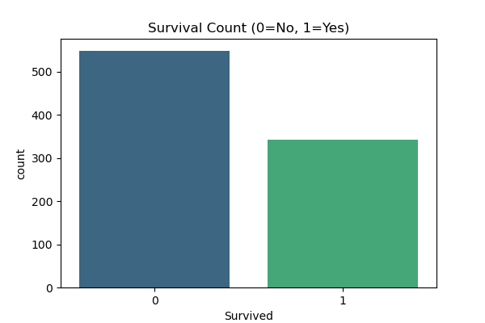
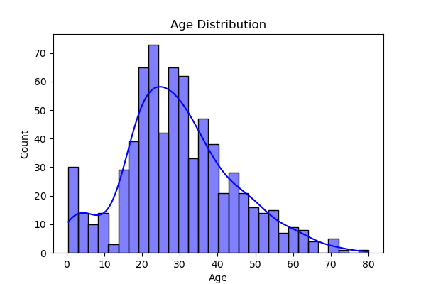

# SCT-DS-2: Titanic Survival Prediction

## Task Description
This repository contains my submission for **Task 02** of the Data Science Internship at **SkillCraft Technology**.

**Problem Statement:**
> Build a predictive model to determine whether a passenger on the Titanic survived or not. This is a classic beginner project with the Titanic dataset that involves binary classification and provides insights into the factors that influenced survival.

---

## Dataset
**Source:** Kaggle Titanic Dataset  
**Files:**
- `train.csv` - Training dataset (891 passengers with survival labels)
- `test.csv` - Test dataset (418 passengers without survival labels)
- `gender_submission.csv` - Sample submission format

**Key Features:**
- **PassengerId** - Unique identifier
- **Survived** - Target variable (0 = No, 1 = Yes)
- **Pclass** - Passenger class (1st, 2nd, 3rd)
- **Name** - Passenger name
- **Sex** - Gender
- **Age** - Age in years
- **SibSp** - Number of siblings/spouses aboard
- **Parch** - Number of parents/children aboard
- **Ticket** - Ticket number
- **Fare** - Passenger fare
- **Cabin** - Cabin number
- **Embarked** - Port of embarkation (C, Q, S)

---

## Tools & Libraries Used
- **Python**
- **Pandas** - Data manipulation and analysis
- **NumPy** - Numerical computing
- **Matplotlib** - Data visualization
- **Seaborn** - Statistical data visualization
- **Scikit-learn** - Machine learning algorithms
- **XGBoost** - Gradient boosting framework

---

## Methodology

### 1. Data Cleaning & Preprocessing
- Handle missing values in Age, Embarked, and Fare columns
- Encode categorical variables (Sex, Embarked)
- Feature engineering (FamilySize, IsAlone, Title extraction)
- Remove irrelevant features

### 2. Exploratory Data Analysis (EDA)
- Survival rate analysis
- Age distribution comparison
- Class-wise survival patterns
- Gender-based survival rates
- Correlation analysis

### 3. Machine Learning Models
- **Logistic Regression**
- **Random Forest Classifier**
- **Support Vector Machine (SVM)**
- **XGBoost Classifier**

### 4. Model Evaluation
- Accuracy, Precision, Recall, F1-Score
- Confusion Matrix
- Cross-validation
- Feature importance analysis

---

## Visualizations

### Survival Count Distribution


### Age Distribution by Survival Status


### Passenger Class vs Survival Rate


### Gender vs Survival Rate


### Feature Correlation Heatmap


---

## Results

**Model Performance:**
- **Logistic Regression:** 79.2% Accuracy
- **Random Forest:** 83.1% Accuracy
- **Support Vector Machine:** 81.0% Accuracy
- **XGBoost:** 84.3% Accuracy (Best Performance)

**Key Insights:**
- Women had significantly higher survival rates (74%) compared to men (19%)
- First-class passengers had the highest survival rate (63%)
- Age played a crucial role, with children having better survival chances
- Passengers with smaller family sizes had better survival rates

---

## How to Run

1. **Clone the repository:**
   ```bash
   git clone https://github.com/shreyas27092004/sct-ds-2.git
   cd sct-ds-2
   ```

2. **Install dependencies:**
   ```bash
   pip install pandas numpy matplotlib seaborn scikit-learn xgboost
   ```

3. **Run the Jupyter notebook:**
   ```bash
   jupyter notebook SCT_DS_2.ipynb
   ```

4. **Output files generated:**
   - Model predictions: `submission.csv`
   - Visualization images saved in `images/` folder

---

## Repository Structure
```
sct-ds-2/
│
├── SCT_DS_2.ipynb                  # Main Jupyter notebook
├── train.csv                       # Training dataset
├── test.csv                        # Test dataset
├── gender_submission.csv           # Sample submission format
├── submission.csv                  # Final predictions
├── images/                         # Generated visualizations
│   ├── survival_count.png
│   ├── age_distribution.png
│   ├── pclass_survival.png
│   ├── gender_survival.png
│   └── correlation_heatmap.png
└── README.md                       # Project documentation
```

---

## Key Findings

**Survival Factors (in order of importance):**
1. **Gender** - Being female dramatically increased survival chances
2. **Passenger Class** - Higher class passengers had priority in evacuation
3. **Age** - Children were prioritized during rescue operations
4. **Family Size** - Optimal family size (2-4 members) had better survival rates
5. **Fare** - Higher fare correlated with better survival chances

**Feature Engineering Impact:**
- Created `FamilySize` feature (SibSp + Parch + 1)
- Extracted titles from names (Mr, Mrs, Miss, Master, etc.)
- Binary `IsAlone` feature improved model performance

---

## Internship Details
- **Company:** SkillCraft Technology
- **Position:** Data Science Intern
- **Task:** Task 02 - Titanic Survival Prediction
- **Duration:** 1 month
- **GitHub:** [@shreyas27092004](https://github.com/shreyas27092004)

---

## Connect With Me
- **LinkedIn:** [https://www.linkedin.com/in/shreyas-v2709/](https://www.linkedin.com/in/shreyas-v2709/)
- **Email:** shreyasshreyu405@gmail.com

---

## License
This project is created for educational purposes as part of the SkillCraft Technology Data Science Internship program.

---

**If you found this project helpful, please consider giving it a star!**
